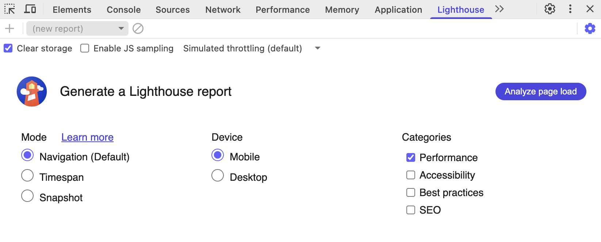
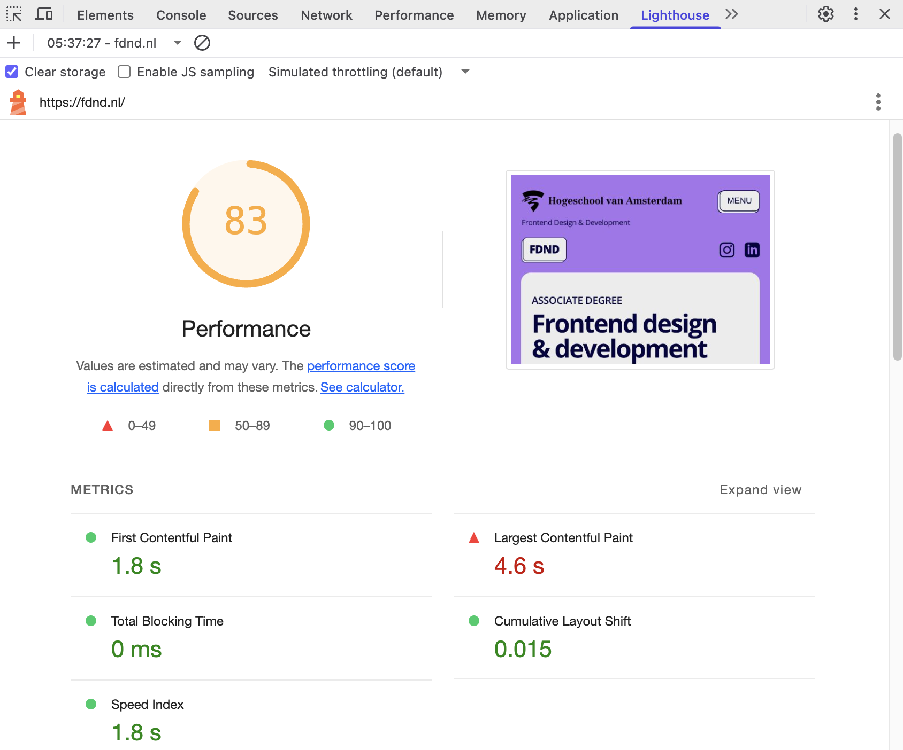
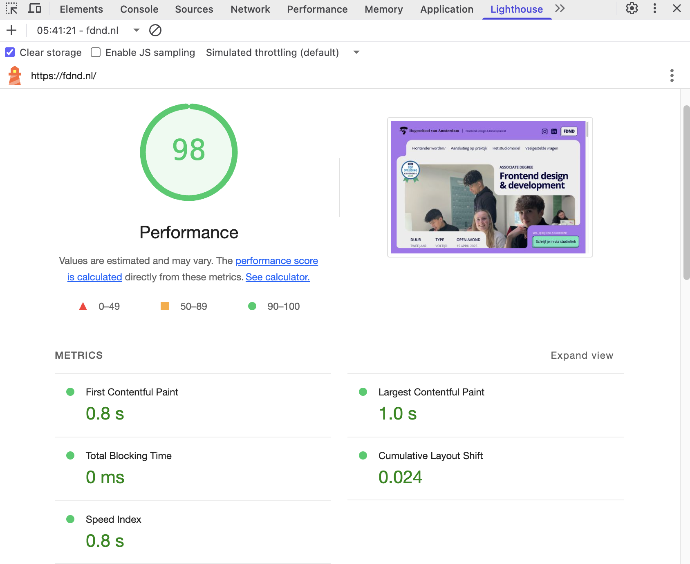
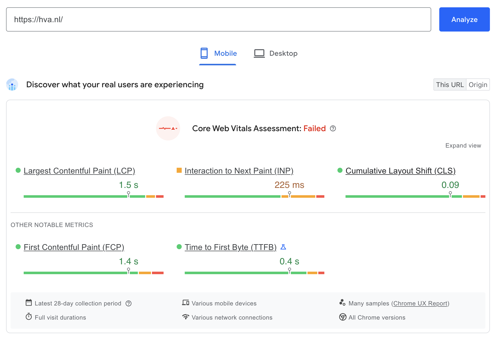
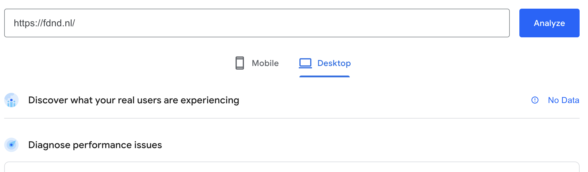
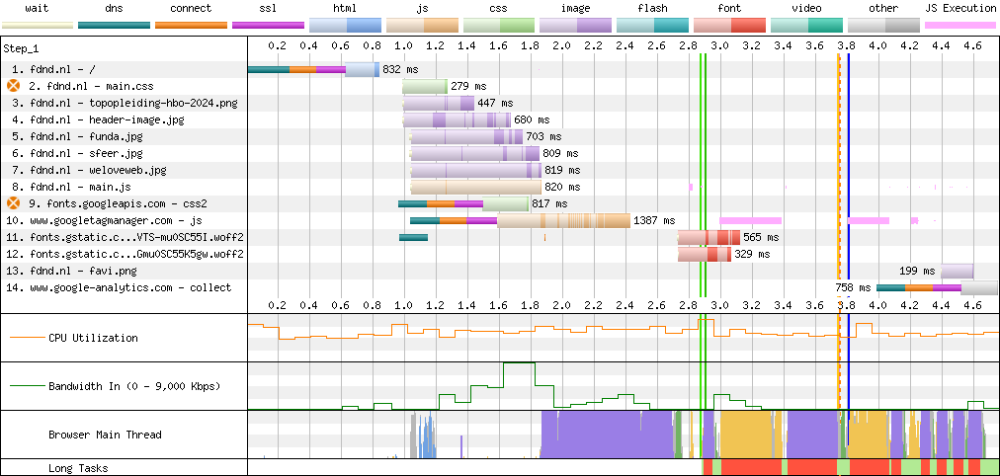

# Performance Audit

Doe een Performance audit op een bestaande website uit je eigen omgeving en rapporteer daarover.

In de workshop S10W1-02-Core-Web-Vitals wordt behandeld hoe je een Performance audit kan uitvoeren.

## Doel van deze opdracht

Je leert hoe je een performance test kan uitvoeren en je presenteert je bevindingen.

## Werkwijze

Fork deze deeltaak, zet je Wiki aan bij Repository Settings en documenteer je test in de Wiki.

Het is de verantwoordelijkheid van een frontender dat een website voor verschillende mensen, met verschillende apparaten, in verschillende situaties, _Snel_ is. Met goede code kun je ervoor zorgen dat mensen met een (tijdelijke) trage verbinding, een trager apparaat, of een oudere browser een website ook op een prettige manier kunnen gebruiken.

Stel je voor dat de bundel van de gebruiker van jouw website net leeg is, of die gebruiker een oude versie van Firefox gebruikt, of een iPhone van 5 jaar oud, of op een tweedehands laptop met oude Intel process surft. Of ...

Een goede snelle website voldoet onder andere aan de _[Web Vitals metrics](https://web.dev/articles/vitals)_.

Voor het testen van _Performance_ kun je een website automatisch testen in de browser met bijvoorbeeld de tool _Lighthouse_ van Google (die we ook al gebruikten voor de WCAG Audit uit Sprint 3). Voor deze opdracht ga je zo'n test uitvoeren en documenteer je wat je hebt getest in de Wiki van deze deeltaak.

1. Eerst ga je een [Lighthouse test](#1-lighthouse-test) doen van een bestaande website en documenteer je de belangrijkste bevindingen uit de test in je Wiki
2. Daarna gebruik je [PageSpeed Insights](#2-pagespeed-insights) om een inzicht te krijgen in de _Real User Metrics_ van die website, die je ook documenteert in je Wiki
3. Vervolgens onderzoek je met [WebPageTest](#3-webpagetest) de mogelijke oorzaken en oplossingen van problemen, die je ook documenteert in je Wiki

### Bronnen documenteren

- [About READMEs](https://docs.github.com/en/repositories/managing-your-repositorys-settings-and-features/customizing-your-repository/about-readmes)
- [Getting started with writing and formatting on GitHub](https://docs.github.com/en/get-started/writing-on-github/getting-started-with-writing-and-formatting-on-github)
- [Basic writing and formatting syntax](https://docs.github.com/en/get-started/writing-on-github/getting-started-with-writing-and-formatting-on-github/basic-writing-and-formatting-syntax)

### 1. Lighthouse test

Lighthouse is een geautomatiseerde test die je in een Chrome (of op Chromium gebaseerde) browser kan uitvoeren. Je kent deze tool als het goed is al van de [WCAG Audit](https://github.com/fdnd-task/wcag-audit) uit Sprint 3.

Naast een snelle test op _Toegankelijkheid_, kan Lighthouse ook een _Performance_ test doen. Je begint de Performance audit dus met een Lighthouse test.

Zo start je een Lighthouse Performance test:

Voor Mobile kunnen de resultaten er bijvoorbeeld zo uit zien:

En voor Desktop zo:

En zo kun je de verschillende Diagnostics bekijken:

<video width="800" src="lighthouse-results.mp4"></video>

#### Aanpak

- Ga naar een website uit je eigen omgeving, bijvoorbeeld die van je eigen voetbalvereniging, yogaclub, muziekschool, bijbaantje, fitnessschool of het werk van je ouders. Leuk om hier niet dezelfde site als in Sprint 3 te gebruiken, maar weer even verder te kijken.
- Open de Devtools en klik naar Lighthouse.
- Selecteer alleen _Performance_ en zorg dat _Clear storage_ aan staat en _Throttling_ op _default_. 
- Run de test voor Mobile, maak een screenshot van de score en zet deze in de Wiki.
- Bekijk de _Diagnostics_ van het Lighthouse rapport en documenteer de problemen en de goede uitkomsten (Passed Audits) van de test in de Wiki. 
- Schrijf bij elk onderdeel in je eigen woorden wat het betekent. Vraag om hulp als je niet begrijpt wat de verschillende problemen betekenen.
- Run de test nogmaals, deze keer voor Desktop, maak een screenshot van de score en zet deze in de Wiki.
- Bekijk de _Diagnostics_ van het Lighthouse rapport en documenteer de (grote) verschillen met je Mobile test in je Wiki.

#### Bronnen Lighthouse test

 - [Lighthouse performance scoring](https://developer.chrome.com/docs/lighthouse/performance/)
 - [Web Vitals](https://web.dev/articles/vitals)
 
### 2. PageSpeed Insights

Lighthouse is een geautomatiserde test, die lokaal op jouw machine draait. Net als bij Toegankelijkheid heb je inmiddels door dat de realiteit net iets complexer is dan wat het lijkt. Jouw machine en browser zijn waarschijnlijk snel. Lighthouse doet een soort simulatie van een trager apparaat (door de _Throttling_ setting), maar in het echt spelen veel meer factoren mee.

Google verzamelt al een tijdje performance statistieken van alle Chrome gebruikers wereldwijd. Van échte gebruikers dus. Deze statistieken zijn verzameld in het _Chrome User Experience Report_ (CrUX), die volledig openbaar zijn. Deze gegevens worden ook door Google gebruikt voor het ranken van websites. Performance vormt namelijk een groot onderdeel van de _User Experience_, en Google stuurt bezoekers graag door naar Goede Websites.

Via onder andere PageSpeed Insights kun je een kijkje in die data nemen. Dus laten we dat eens gaan doen.

Als er gegevens beschikbaar zijn voor een domein of pagina, ziet dat er zo uit:

Als er geen gegevens beschikbaar zijn, ziet dat er zo uit:

#### Aanpak

- Ga naar https://pagespeed.web.dev/ en analyseer de site die je net ook getest hebt. Als het goed is, komen de Performance issues op Mobile en Desktop grofweg overeen met die van Lighthouse in je browser. PageSpeed Insights gebruikt namelijk ook Lighthouse voor deze tests.
- Controleer of er (grote) verschillen zitten tussen je eerdere Mobile en Desktop tests en deze, en documenteer de bevindingen in je Wiki.
- Als er data beschikbaar is in het Chrome User Experience Report, maak hiervan dan een screenshot, en zet deze ook in je Wiki (voor zowel Mobile als Desktop).

#### Bronnen PageSpeed Insights

- [PageSpeed Insights](https://pagespeed.web.dev/)
- [About PageSpeed Insights](https://developers.google.com/speed/docs/insights/v5/about)
- [Overview of CrUX](https://developer.chrome.com/docs/crux)

### 3. WebPageTest

Lighthouse is top, maar het kan niet alles. Helaas. Om echt goed inzicht te krijgen in de oorzaken van performance problemen, kunnen we WebPageTest gebruiken. Hiermee krijg je echt een deep-dive in alles wat er gebeurt in de browser. Je kunt zelf selecteren op welke browser deze test uitgevoerd moet worden, met welke connectie, vanaf welk continent, en nog veel meer.

Met name de _Waterfall_ charts zijn voor frontenders interessant, want deze worden voor een groot deel beïnvloed door de HTML, CSS en client-side JavaScript die we naar de browser sturen.

Zo ziet een Waterfall chart van WebPagetest er uit:

#### Aanpak

- Ga naar https://www.webpagetest.org/ en start een Site Performance test voor de site die je net getest hebt. Je krijgt ook hier weer wat Core Web Vitals getallen terug, omdat dit zo'n beetje de standaard is in deze industrie. Maar die hebben we zo ondertussen wel.
- Scroll naar de eerste Waterfall chart en open deze.
- Kopieer de afbeelding van de Waterfall View naar je Wiki.
- Probeer in je Wiki zoveel mogelijk performance problemen te verklaren aan de hand van deze Waterfall chart.
- Welkom in de wereld van Performance testing :)

#### Bronnen WebPageTest

- [WebPageTest](https://www.webpagetest.org/)
- [How to read a WebPageTest Waterfall View chart](https://nooshu.com/blog/2019/10/02/how-to-read-a-wpt-waterfall-chart/)

## Definition of done

Deze opdracht is done als:

- [ ] Je hebt voor Mobile een Lighthouse Performance test gedaan op een bestaande website en de test is gedocumenteerd in de Wiki van deze deeltaak
- [ ] Je hebt voor Desktop een Lighthouse Performance test gedaan op een bestaande website en de test is gedocumenteerd in de Wiki van deze deeltaak
- [ ] Je hebt een PageSpeed Insights test gedaan op een bestaande website en de verschillen en Chrome User Experience Report data zijn gedocumenteerd in de Wiki van deze deeltaak
- [ ] Je hebt een WebPageTest Site Performance test gedaan op een bestaande website en de waterfall chart is gedocumenteerd in de Wiki van deze deeltaak
